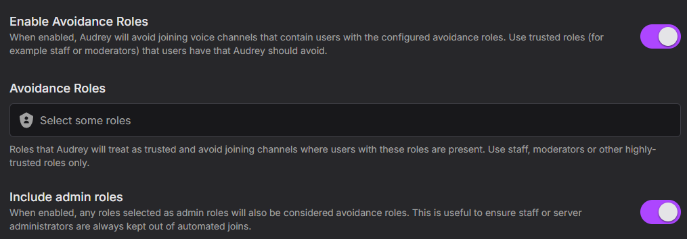

If you don't want Audrey to join whenever certain members with a role or admins join a voice channel, you can add them as **Avoidance Roles**, where Audrey will avoid joining voice channels with them. This can be helpful if you trust members with a certain role or would prefer moderators in that voice channel to moderate that voice channel.

When this option is enabled, it also includes the set admin roles by default as the usual use case is to let staff moderate channels, but this can be disabled to add other roles in instead.

