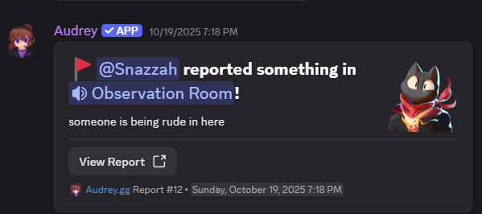
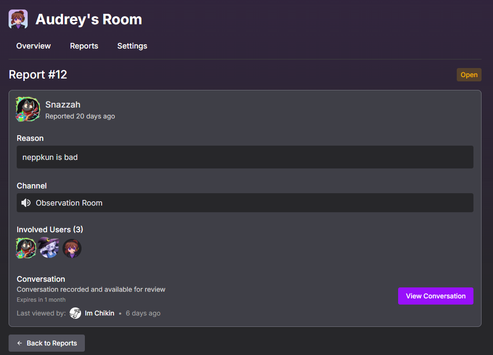
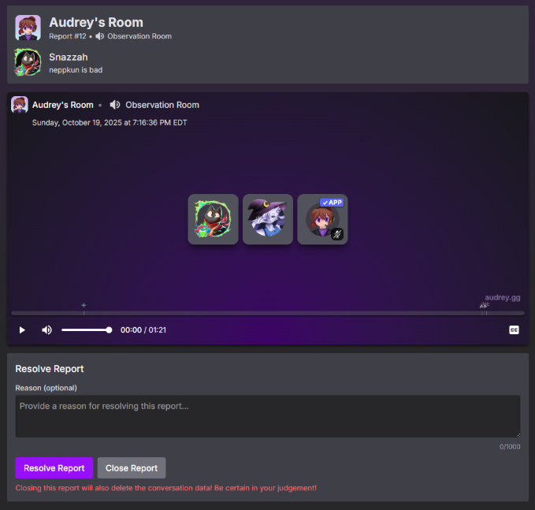

import { Aside } from '@astrojs/starlight/components';

Any server members that is in a voice channel can report using either the /report-vc commans or a "Report VC Incident" button that can be put in any channel the server staff sent it in.

When reporting, the server members can include a reason. When a report is created it will be logged and available in Audrey's dashboard.

Each report shows the channel name, date of report, who reported, and the included users in the report, which are all the users that were apart of the voice channel conversation, whether they are actually apart of the report or not.

Report conversations have an expiry date, when a report is first created, staff must at least view the conversation once to avoid the report expiring. Once the report has been viewed once, the expiry will be extended. This encourages staff members to be active and handle reports in a timely manner. The initial expiry time is 7 days for mostly everyone.

## Report Viewer
The report viewer allows staff to view the reported conversation, which shows the current users in the channel along with whos talking, soundboard usage, and shows if someone is live or uses their camera.

<Aside>Audrey CANNOT record video, and these will not show up in reports, you will only know who had their camera on.</Aside>

The viewer will also transcribe the report in the background while you view it, allowing for rough captions of the report. Reviewing the report will keep those same captions to use for later.

From the viewer, you can resolve or close a report. Closing a report is considered saying that it is invalid, and the conversation data will be deleted after closing it. Resolving means that the report has been reviewed and solved.