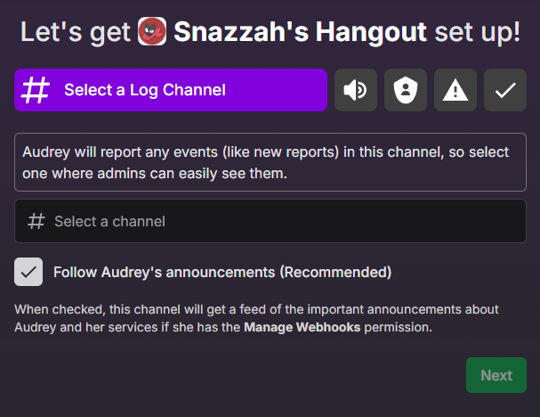
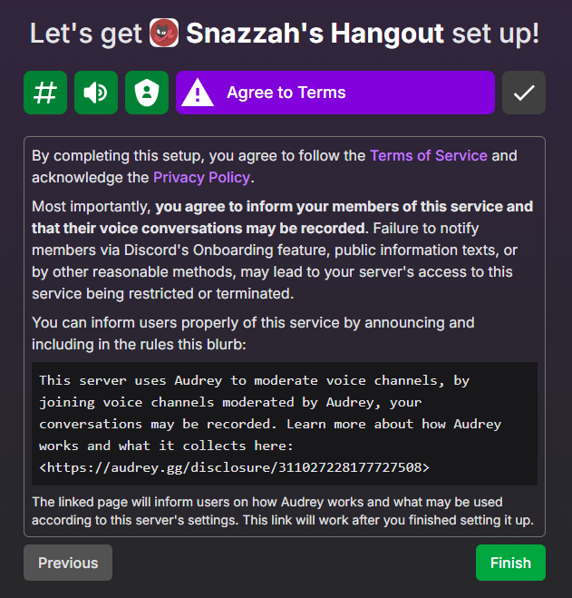

import { LinkButton } from '@astrojs/starlight/components';

In order to start using Audrey in your server, you can add the bot with the link below. You should be redirected to a webpage after adding that walks you through the nessesary settings and disclaimers.

<LinkButton href="https://audrey.gg/api/login?next=add_bot">Add Audrey to your server!</LinkButton>

During the set up process, you will be asked to specify channels to moderate, roles to assign as admin roles, and other settings. Audrey can also make it so that announcements and updates for Audrey will be followed using Discord's webhooks, you can turn this off at any time.

Towards the end of the set up process you will have to make sure that members of the server are informed about the nature of this service by adding the given blurb in a rules or info channel and announcing it after finishing.

After setting it up, the next time someone joins or leaves a channel, Audrey will start monitoring channels. Check out other pages to see what features Audrey provides!